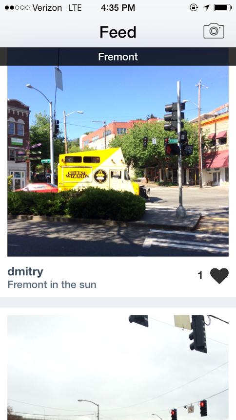

- Designed, developed and shipped iOS app for sharing pictures with people around you (like Snapchat for places) 
- Built out image submission flow, local image feed, direct messaging among other experiences - Worked with multiple web APIs, MapKit, background uploading, asynchronous content loading 
